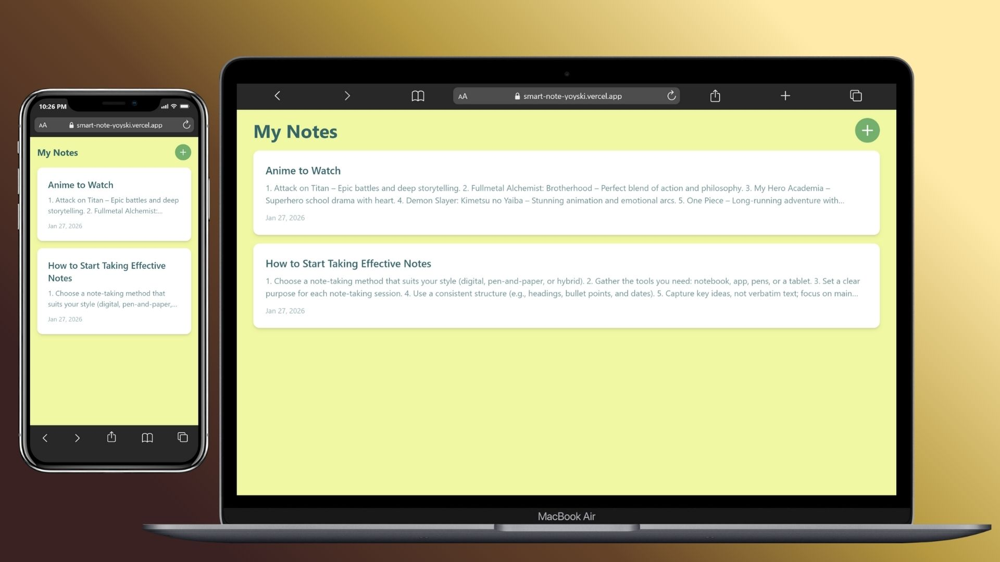
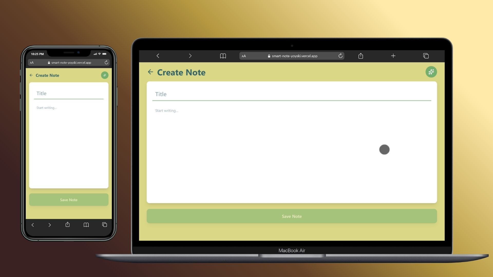
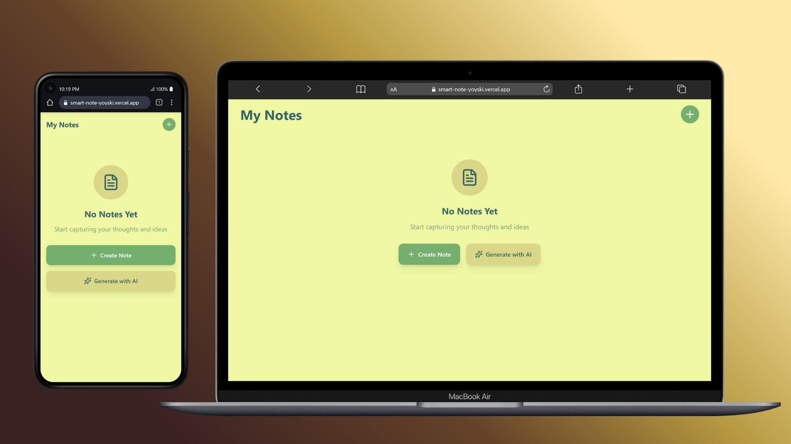

# 🗒️ Smart Note App

<div align="center">


[](LICENSE)
[](https://reactjs.org/)
[](https://anthropic.com)

**A modern, AI-powered note-taking application designed for productivity and clarity.**

[Features](#-features) • [Demo](#-demo) • [Installation](#-installation) • [Usage](#-usage) • [Tech Stack](#-tech-stack)

</div>

---

## 📸 Screenshots

### Home Dashboard

_Clean, intuitive interface with all your notes at a glance_

### AI-Powered Creation

_Generate, improve, or summarize notes with AI assistance_

### Note Editor

_Distraction-free writing environment with AI tools_

### Empty State

_Welcoming interface for new users_

---

## ✨ Features

### 📝 Core Functionality

- **Intuitive Note Management** - Create, read, update, and delete notes with ease
- **Rich Text Editor** - Clean, distraction-free writing environment
- **Smart Organization** - Automatic date tracking and note sorting
- **Responsive Design** - Seamless experience across desktop and mobile devices

### 🤖 AI-Powered Intelligence

- **AI Content Generation** - Create complete notes from simple prompts
- **Smart Improvement** - Enhance clarity, structure, and professionalism automatically
- **Intelligent Summarization** - Condense long notes into concise key points
- **Context-Aware Suggestions** - Get AI assistance tailored to your content

### 💾 Data Management

- **In-Memory Storage** - Fast, session-based note persistence
- **No Data Loss** - Notes saved automatically during your session
- **Quick Access** - Instant load times for all your content

### 🎨 User Experience

- **Modern UI Design** - Clean, professional interface with custom color palette
- **Smooth Animations** - Polished transitions and hover effects
- **Undo Functionality** - Revert changes with a single click
- **Empty State Guidance** - Clear CTAs for new users

---

## 🎯 Demo

### Quick Start Guide

1. **Create Your First Note**
   - Click the `+` button or "Create Note" from empty state
   - Use AI to generate content or write manually

2. **Enhance with AI**
   - Click the ✨ sparkle icon in the editor
   - Choose to improve, summarize, or generate new content

3. **Manage Your Notes**
   - View, edit, or delete notes from the dashboard
   - Use undo to revert changes during editing
     
---

## 🚀 Installation

### Prerequisites

- Node.js 16+ and npm/yarn
- Modern web browser (Chrome, Firefox, Safari, Edge)

### Setup

```bash
# Clone the repository
git clone https://github.com/yoyski/Smart-Note-App.git

# Navigate to project directory
cd Smart-Note-App

# Install dependencies
npm install

# Start development server
npm run dev
```

The app will be available at `http://localhost:5173`

---

## 💻 Usage

### Creating Notes

```javascript
// Manual Creation
1. Click the '+' floating action button
2. Enter your title and content
3. Click 'Save Note'

// AI Generation
1. Click 'Generate with AI' or the ✨ icon
2. Describe what you want in the prompt
3. AI creates a complete note for you
```

### AI Features

**Generate** - Create notes from descriptions

```
Example: "Create a weekly meal plan for a vegetarian diet"
```

**Improve** - Enhance existing content

```
Takes your draft and makes it clearer and more professional
```

**Summarize** - Condense long content

```
Extracts key points from lengthy notes
```

### Keyboard Shortcuts

- `Enter` in AI prompt field - Generate content
- `Undo button` - Revert all changes to original

---

## 🛠️ Tech Stack

### Frontend


- **Framework**: React 18  
- **Build Tool**: Vite  
- **Features**: Fast development, HMR, optimized builds

### Backend


- **Framework**: Node.js + Express  
- **Features**: RESTful API endpoints, server-side logic for notes and AI requests

### Database


- **Database**: MongoDB  
- **Usage**: Persistent storage for notes and user data  

### State Management


- **Library**: Zustand  
- **Usage**: Global state for notes, AI prompts, and modal states

### AI & LLM Integration


- **Models**: Groq AI + ChatGPT  
- **API**: Messages API  
- **Features**: Text generation, content improvement, summarization

### Styling & UI


- **Framework**: Tailwind CSS  
- **Icons**: Lucide React  
- **Custom Palette**:  
  - Primary: `#36656B` (Deep Teal)  
  - Accent: `#75B06F` (Sage Green)  
  - Secondary: `#DAD887` (Soft Yellow)  
  - Background: `#F0F8A4` (Light Cream)

### Deployment & Hosting


- **Frontend Hosting**: Vercel  
- **Backend Hosting**: Render

---

## 🏗️ Architecture

````
src/
├── components/
├── hooks/
│   └── useFetchNoteById.js
│   └── usePersistedState.js
├── lib/
├── pages/
│   └── CreatePage.js
│   └── HomePage.js
│   └── NoteEditPage.js
│   └── ViewPage.js
├── stores/
├── styles/
└── App.jsx                  # Root component

---

## 🔐 Environment Variables

Create a `.env` file in the root directory:

```env
# Not required for current implementation
# API key is handled by Claude.ai environment
````

> **Note**: This app uses Claude's built-in API access. No external API keys needed when running in Claude.ai artifacts.

---

## 🎨 Color Palette

| Color       | Hex       | Usage                      |
| ----------- | --------- | -------------------------- |
| Deep Teal   | `#36656B` | Primary text, dark buttons |
| Sage Green  | `#75B06F` | Action buttons, accents    |
| Soft Yellow | `#DAD887` | Create/Edit backgrounds    |
| Light Cream | `#F0F8A4` | Home/Detail backgrounds    |

---

## 🙏 Acknowledgements

### Powered By

- [Groq](https://groq.com/) - AI language model
- [React](https://reactjs.org) - UI framework
- [Lucide Icons](https://lucide.dev) - Beautiful icons
- [Tailwind CSS](https://tailwindcss.com) - Styling framework

### Inspiration

Built with a passion for clean architecture, intuitive design, and the power of AI-assisted productivity.

---

## 📧 Contact

**Project Maintainer**: [@yoyski](https://github.com/yoyski)

**Issues & Support**: [GitHub Issues](https://github.com/yoyski/Smart-Note-App/issues)

---

<div align="center">

**Made with ❤️ and AI**

</div>
